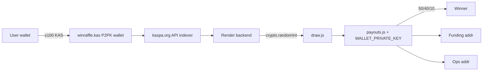
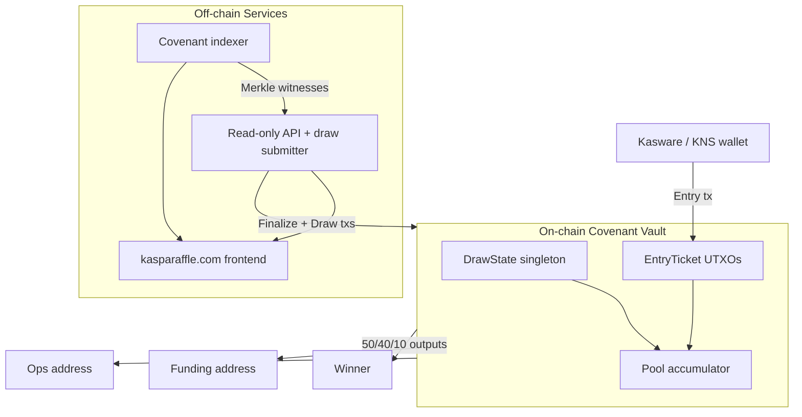
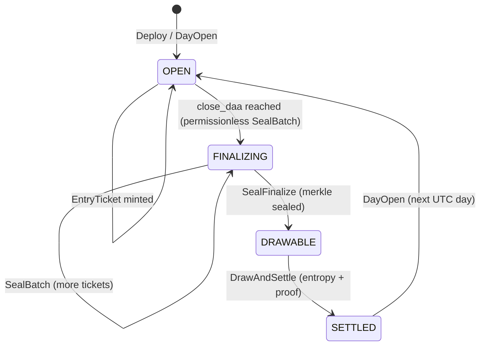
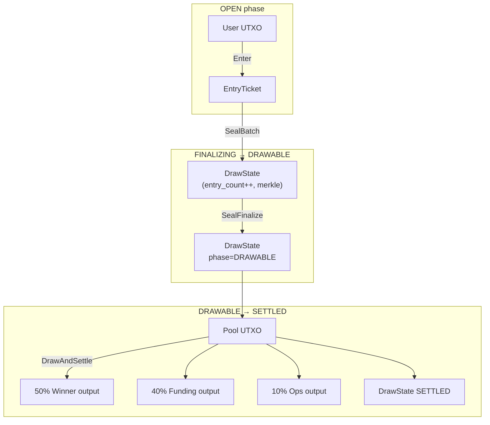
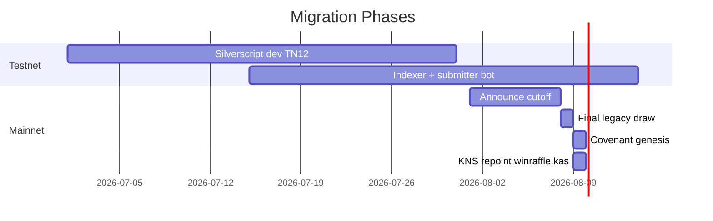

# Kaspa Daily Raffle — Phase 2 Covenant Vault Specification

**Project:** [kasparaffle.com](https://kasparaffle.com)  
**Repo:** `C:\Users\smoot\OneDrive\Desktop\Kaspa Raffle Website\kaspa-raffle-website\`  
**Status:** Draft for engineering kickoff (post-Toccata mainnet, July 2026)  
**Scope:** Trust-minimized custody + payout enforcement on L1; hybrid verifiable randomness (Phase 3 → ZK)

---

## 1. Executive Summary

Phase 2 replaces the **trusted server wallet** (`WALLET_PRIVATE_KEY` in `backend/lib/payouts.js`) with a **covenant vault** deployed after Kaspa’s **Toccata** hard fork (activated mainnet ~June 30, 2026 at DAA `474,165,565`). The covenant enforces:

- **Entry rules:** ≥ 100 KAS per qualifying transaction (matching `MIN_ENTRY_KAS` in `backend/lib/kaspa-api.js`)
- **Custody:** Entry funds locked in covenant lineage until draw settlement
- **Payout split:** Exactly **50% winner / 40% funding / 10% ops** (matching `buildOutputs` in `backend/lib/payouts.js`)
- **Draw window:** UTC calendar day boundaries anchored via **DAA score thresholds**

What remains **off-chain / hybrid in Phase 2:**

- **Winner index derivation** uses a **public, reproducible algorithm** over the entry set + block entropy, but submitting the draw transaction still requires an **indexer-assisted Merkle witness** (covenant verifies the proof, not the indexer’s honesty about randomness).
- **Funding description text** and marketing copy remain website-only (on-chain: immutable funding address).

Phase 3 targets **stronger randomness** (ZK-verified draw or commit-reveal with economic bonds).

---

## 2. Current System Baseline (Accurate Reference)

### 2.1 Addresses & resolution

| Role | Value |
|------|-------|
| Display / KNS | `winraffle.kas` |
| On-chain fallback | `kaspa:qr3rxmae6r5h9kkt7q5my7rajy492da7cxpy0kkzr99tk3xcydc2uwa3a7u6r` |
| Resolver | `backend/lib/kns-resolve.js` (KNS API + `KNOWN_KNS_FALLBACK`) |

### 2.2 Raffle rules (as implemented)

| Rule | Implementation |
|------|----------------|
| Min entry | 100 KAS (`MIN_ENTRY_KAS`, `10_000_000_000` sompi) |
| Ticket counting | 1 accepted tx with total outputs to raffle address ≥ 100 KAS = 1 entry (`parseEntriesForDay`) |
| Draw time | Daily **midnight UTC**; server triggers when `getUTCHours() === 0 && getUTCMinutes() < 5` (`server.js`) |
| Jackpot | Wallet balance at end of raffle day (`jackpotAtEndOfDay` → `balanceAtTime` at `endMs - 1`) |
| Winner selection | `crypto.randomInt(0, entries.length)` in `backend/lib/draw.js` — **trusted** |
| Payout split | 50% / 40% / 10% of jackpot (`payouts.js` `buildOutputs`) |
| Funding address | Mutable via admin panel (`/api/admin/funding` → `config.js`) |
| Ops address | `OPS_ADDRESS` env var; falls back to raffle wallet change address |
| Catch-up | `catchUpMissedDraws` replays missed UTC days after outage |
| Frontend | `index.html` polls Render API (`/api/jackpot`, `/api/config`) every 15s; QR/copy for `winraffle.kas` |

### 2.3 Trust surface today



**Phase 2 goal:** Move the red nodes (custody, split enforcement, draw-window gating) on-chain; shrink backend to indexer + UX.

---

## 3. Toccata / Covenant Platform Context

| Component | Relevance |
|-----------|-----------|
| **Toccata** (KIP-16) | Activates covenant opcodes, tx version 1, fee policy changes |
| **KIP-17** | Covenant introspection opcodes (`OpTx*`, output value/script checks) |
| **KIP-20** | `covenant_id` on UTXOs; genesis + continuation; `OpAuthOutput*`, `OpCovInput*` |
| **Silverscript** | High-level covenant language; **testnet-12** experimental; compiles to Kaspa Script |
| **rusty-kaspa v2.0.1+** | Required node/SDK; WASM SDK already vendored in repo (`kaspa-wasm32-sdk-v2.0.1.zip`) |

**Covenant lineage:** One `covenant_id` per raffle deployment (genesis from deploy tx). All vault UTXOs share this id.

**Authoring strategy:** Implement core transitions in **Silverscript** on testnet-12; audit-generated script; mainnet deploy only after TN12 soak test.

---

## 4. Architecture Overview



### 4.1 Design principles

1. **Singleton + split pattern (KIP-20):** One `DrawState` UTXO coordinates day lifecycle; many `EntryTicket` UTXOs; one `Pool` UTXO accumulates settled entry value.
2. **Immutable payout destinations at genesis:** `funding_pubkey` and `ops_pubkey` hashed into genesis `covenant_id`; prevents operator rug on splits.
3. **Permissionless draw submission** after window close (with bond / fee incentive).
4. **Indexer-assisted, covenant-verified:** Indexer computes Merkle tree; covenant verifies inclusion + split math; anyone can reproduce off-chain.

---

## 5. Covenant State Machine

### 5.1 UTXO types

| Type | Cardinality | Purpose | State commitment (P2SH preimage) |
|------|-------------|---------|----------------------------------|
| **DrawState** | 1 per `covenant_id` | Day lifecycle, Merkle root, DAA window, phase enum | See §5.2 |
| **Pool** | 1 per `covenant_id` | Holds aggregated entry sompi for active/settling day | `(day_id, total_sompi)` |
| **EntryTicket** | 0..N | One per qualifying entry; locks ≥100 KAS | `(day_id, entry_leaf_hash, entrant_pubkey_hash)` |
| **PayoutTransition** | Transient | Not a persistent type — authorized outputs of `Settle` transition | N/A |

### 5.2 DrawState fields (32-byte aligned packing)

```
struct DrawState {
  version:        u8      // = 1
  phase:          u8      // OPEN=0, FINALIZING=1, DRAWABLE=2, SETTLED=3
  day_id:         u32     // YYYYMMDD UTC, e.g. 20260702
  open_daa:       u64     // DAA score at day open (inclusive lower bound)
  close_daa:      u64     // DAA score at day close (exclusive upper bound for entries)
  entry_count:    u32     // tickets finalized into Merkle
  merkle_root:    [u8;32] // BLAKE2b tree over entry leaves
  pool_outpoint:  [u8;36] // txid(32) + index(4) of current Pool UTXO
  last_entropy:   [u8;32] // block hash used if SETTLED
  winner_leaf:    [u8;32] // winning entry_leaf_hash if SETTLED
}
```

**Phase transitions:**



### 5.3 Transition catalog

| Transition | Inputs | Authorized outputs | Who can submit |
|------------|--------|-------------------|--------------|
| **DayOpen** | DrawState (SETTLED or genesis) | DrawState(OPEN), Pool(empty) | Coordinator key **or** permissionless after `SETTLED` + 1h timeout |
| **Enter** | User UTXO(s) | EntryTicket, change | Anyone (user entry) |
| **SealBatch** | DrawState, ≤`MAX_BATCH` EntryTickets | DrawState, EntryTickets(spent) | Permissionless after `block_daa ≥ close_daa` **OR** during OPEN with coordinator sig |
| **SealFinalize** | DrawState | DrawState(DRAWABLE) | Permissionless; requires `entry_count > 0` |
| **DrawAndSettle** | DrawState(DRAWABLE), Pool | DrawState(SETTLED), winner/funding/ops outputs | Permissionless; must supply valid proof |
| **NoEntrySettle** | DrawState(DRAWABLE), Pool | DrawState(SETTLED), funding+ops only (100% to 40/10 split of empty pool) | Permissionless |

### 5.4 State machine diagram (UTXO flow)



---

## 6. Entry Format

### 6.1 User-facing behavior (unchanged UX)

- User sends **≥ 100 KAS** to the raffle deposit address (KNS: `winraffle.kas` → covenant deposit script address).
- **One qualifying transaction = one ticket**, matching current `parseEntriesForDay` semantics (not amount-proportional).

### 6.2 On-chain transaction structure

**Transaction version:** `1` (required for covenant bindings)

**`Enter` transaction:**

```
Inputs:
  [0] User UTXO (standard P2PK/P2SH — no covenant)

Outputs:
  [0] EntryTicket covenant output
      value:  user_sent_sompi (MUST be >= 10_000_000_000)
      script: CovenantDepositEnter(day_id)
      covenant: { authorizing_input: 0, covenant_id: RAFFLE_ID }  // genesis path via coordinator
      // OR continuation from DrawState in advanced batch-entry (Phase 2.1)

  [1] Change (optional)
```

**Entry leaf hash** (Merkle leaf, computed identically on-chain/off-chain):

```
entry_leaf_hash = BLAKE2b-256("KaspaRaffleEntryV1" ||
    le_u32(day_id) ||
    le_u64(entry_value_sompi) ||
    entrant_pubkey_hash[20] ||
    le_u32(entry_outpoint_index))
```

Where `entrant_pubkey_hash` is extracted from the spending input’s signature script (P2PKH/P2PK pattern).

### 6.3 Covenant binding rules (Enter)

Silverscript / script MUST verify:

1. `value >= MIN_ENTRY_SOMPI` (`10_000_000_000`)
2. `DrawState.phase == OPEN`
3. `current_block_daa < DrawState.close_daa` (entry cutoff)
4. `OutputCovenantId == RAFFLE_ID`
5. `DrawState.day_id` matches ticket commitment

### 6.4 Metadata

No OP_RETURN required. Entry metadata is **implicit in UTXO state** (covenant-bound script + amount + outpoint). Indexer derives display fields (`addr`, `amount`, `time`) exactly as today’s `parseEntriesForDay` does, but keyed off `EntryTicket` UTXOs instead of plain wallet outputs.

### 6.5 Multi-entry behavior

Sending 300 KAS in **one** tx still yields **one** ticket (matches current: one tx = one entry regardless of overpayment). Overpayment increases pool contribution but not odds. Document clearly on website.

---

## 7. Draw Window — Midnight UTC On-Chain

Kaspa scripts cannot read wall-clock UTC directly. Phase 2 uses **DAA score windows** anchored to UTC midnight.

### 7.1 DAA anchoring algorithm

At each **DayOpen** transition, the coordinator (or permissionless opener) sets:

```
open_daa  = daa_score_of_day_open_block
close_daa = open_daa + ENTRIES_PER_DAY_DAA_BUDGET
```

**`ENTRIES_PER_DAY_DAA_BUDGET`:** `86,400 × DAA_PER_SECOND`  

Use conservative constant **`DAA_PER_SECOND = 1`** (Kaspa targets ~1 BPS). So **`close_daa = open_daa + 86_400`**.

**Calibration:** Coordinator publishes `DayOpen` tx within **5 minutes after UTC midnight** (matching current `server.js` 00:00–00:05 trigger). The `open_daa` is taken from the accepting block of that tx. Small drift (± few minutes) vs true midnight is acceptable if documented; indexer shows “official window” from chain.

### 7.2 Entry eligibility

An `EntryTicket` is valid for day `D` iff:

- `Enter` tx’s accepting block `daa_score ∈ [open_daa, close_daa)`
- Ticket’s committed `day_id == D`

### 7.3 Relationship to current `getDayBounds`

Off-chain indexer **also** filters by `accepting_block_time` in `[startMs, endMs)` for display parity with legacy history. **Consensus uses DAA**; display uses block time. Mismatch window is < few minutes if coordinator is punctual.

### 7.4 Missed DayOpen / catch-up (replaces `catchUpMissedDraws`)

| Scenario | Behavior |
|----------|----------|
| Coordinator misses DayOpen | After `SETTLED`, anyone can call **DayOpen** once prior day is settled |
| Entries during gap | Rejected by covenant (no OPEN DrawState) — user must wait for DayOpen |
| Multiple missed UTC days | Permissionless **DayOpen** only advances one day at a time; backend indexer shows backlog |

**Backend `catchUpMissedDraws`:** Replaced by monitoring `DrawState.day_id` vs UTC and alerting if `phase` stuck; optional helper bot submits `DayOpen` / `SealFinalize` / `DrawAndSettle`.

---

## 8. Winner Selection (Phase 2 Hybrid)

### 8.1 Goals

- **Publicly verifiable** given: entry Merkle root, entry count, entropy block hash, and winner proof.
- **Permissionless submission** after `DRAWABLE`.
- **Covenant-enforced** winner payout to the entrant pubkey committed in the winning leaf.
- Acknowledge **miner influence** on entropy (see §13).

### 8.2 Entropy block selection

```
entropy_block = first block B such that:
  B.daa_score >= close_daa
  AND B is in the same day_id epoch (coordinator attestation in witness, verified against hash chain)
```

**Concrete rule:** Let `H = header_hash(entropy_block)`. The draw tx witness includes `H` and a **simple payment proof** that `H` is the first post-close block (indexer supplies chain of header hashes; covenant verifies `H` links to a known checkpoint committed in DrawState at SealFinalize — **light client checkpoint**, not full chain).

**Phase 2 simplification (implement first):** Coordinator commits `entropy_block_hash` in `SealFinalize` witness after close, with **24h challenge window** before `DrawAndSettle` unlocks. Document as **weak trust** bridge to Phase 3. Flag in UI: “entropy block committed at finalize.”

**Phase 2.1 upgrade:** Replace coordinator commit with NiPoPoW-style proof or multiple independent entropy submissions.

### 8.3 Winner index algorithm

Given:

- `N = entry_count` (must be > 0)
- `R = merkle_root`
- `H = entropy_block_hash`
- `D = day_id`

```
seed = BLAKE2b-256("KaspaRaffleDrawV1" || H || R || le_u32(D) || le_u32(N))
winner_index = uint256(seed) mod N
```

**Entry ordering:** Leaves sorted lexicographically by `entry_leaf_hash` before tree build. `winner_index` selects the leaf at that position in sorted order.

### 8.4 Draw transaction witness

`DrawAndSettle` must include:

1. `winner_index`
2. `entropy_block_hash`
3. Merkle multiproof for `entry_leaf_hash` at `winner_index`
4. Spent `EntryTicket` UTXO reference matching leaf
5. Entrant pubkey for winner output script

**Covenant verifies:**

```
computed_index = f(H, R, D, N)
computed_index == winner_index
merkle_verify(R, leaf, proof, winner_index)
leaf == entry_leaf_hash(ticket)
pool_value == sum(entries) // invariant maintained across SealBatch
outputs == split_50_40_10(pool_value, winner_pubkey, FUNDING_PK, OPS_PK)
```

### 8.5 Who can submit?

**Anyone.** No coordinator signature on `DrawAndSettle`.

**Anti-griefing:**

| Mechanism | Detail |
|-----------|--------|
| **Invalid draw rejection** | Wrong proof / index → tx fails; grief cost = tx fees only |
| **First valid wins** | DrawState `phase` moves to `SETTLED`; duplicates rejected |
| **Min fee compliance** | Must pay post-Toccata min fee (§11) |
| **Optional draw bounty** | `ops_sompi` includes pre-committed 0.1% bonus to draw submitter (product decision) |

### 8.6 Zero-entry days

If `N == 0` at finalize: `NoEntrySettle` sends empty pool (0) or dust to funding/ops; state → `SETTLED`. Matches current `no_entries` draw record.

---

## 9. Payout Outputs — 50/40/10 Enforcement

### 9.1 Genesis-committed addresses

At **covenant genesis**, `auth_outputs` includes immutable script pubkeys:

```
FUNDING_SPK = from admin-chosen kaspa address (current config.fundingAddress)
OPS_SPK     = from OPS_ADDRESS env (or dedicated ops wallet)
```

These are hashed into `covenant_id` per KIP-20 §3.2 — **cannot change without new deployment**.

**Funding description** (`fundingDescription` in `config.js`) stays **off-chain** on website only.

### 9.2 Sompi split math (exact on-chain)

For pool value `P` (sompi):

```
winner_sompi  = (P * 50) / 100
funding_sompi = (P * 40) / 100
ops_sompi     = P - winner_sompi - funding_sompi   // remainder absorbs rounding
```

Covenant uses **integer arithmetic** only; `OpOutputValue` checks on all three outputs.

**Winner output script:** P2PK/P2PKH to `entrant_pubkey` from winning `EntryTicket` (not ticket contract address).

### 9.3 Comparison to current `payouts.js`

| Current | Phase 2 |
|---------|---------|
| `balanceKas * 0.5/0.4/0.1` floats | Integer sompi division |
| Skips invalid funding address | Funding **always** enforced (genesis commit) |
| Change → ops address | Explicit ops output |

### 9.4 Upgrade path for funding rotation

Current admin panel can change funding anytime. Phase 2 options:

| Option | Tradeoff |
|--------|----------|
| **A. New covenant deploy** (recommended) | True immutability; migrate KNS pointer |
| **B. Two-phase governance covenant** | `OPS` multisig can authorize `DrawState` with new `funding_spk` — adds complexity |
| **C. Funding via ops sub-wallet** | Ops manually forwards 40% — **defeats trust model** — reject |

**Recommendation:** Option A — announce funding address lock per “season”; admin panel edits only **next season** genesis.

---

## 10. Migration Plan

### 10.1 Timeline



### 10.2 In-flight entries at cutoff

**Cutoff instant:** `T_cutoff` = last UTC second before migration day (documented on site).

| Period | Handling |
|--------|----------|
| Entries before `T_cutoff` on old wallet | Final **legacy** `runDrawForDate` + `sendPayouts` for that UTC day |
| Entries after covenant live | Must use covenant deposit address |
| Straddling txs (mempool) | Resolve by accepting block time vs `T_cutoff`; manual review if ambiguous |

### 10.3 Wallet fund migration

1. After final legacy payout, remaining dust from `kaspa:qr3rxmae6r5h9kkt7q5my7rajy492da7cxpy0kkzr99tk3xcydc2uwa3a7u6r` swept to **ops** or seed-funded into covenant Pool genesis (marketing bonus pool).
2. **Retire `WALLET_PRIVATE_KEY`** on Render; delete from `.env` templates.
3. Archive `draw-state.json` / `payout-history.json` as legacy read-only API.

### 10.4 KNS update

- Point `winraffle.kas` owner to covenant **deposit script address** (human-readable prefix via KNS metadata).
- Keep `KNOWN_KNS_FALLBACK` updated in `kns-resolve.js` with new script address.

### 10.5 Rollback plan

If covenant bug found pre-first-draw: pause KNS, revert to legacy wallet, replay entries from index. Post-first-settlement: **no rollback** — deploy fixed covenant v2.

---

## 11. Website vs On-Chain Responsibilities

| Concern | On-chain covenant | Backend / frontend |
|---------|-------------------|-------------------|
| ≥100 KAS entry | ✅ enforced | Display |
| 1 tx = 1 ticket | ✅ enforced | Display |
| Midnight UTC window | ✅ DAA window | Display countdown (indexer) |
| Jackpot size | ✅ Pool value | Display |
| Entry list | Ticket UTXOs exist | Indexer enumeration + API |
| Winner selection | ✅ split + pubkey | Publish algorithm + verify tool |
| Randomness entropy | ⚠️ hybrid (§8.2) | Publish `H`, reproduce seed |
| 50/40/10 split | ✅ enforced | Display |
| Funding **address** | ✅ immutable genesis | Display |
| Funding **description** | ❌ | Admin panel (optional) |
| `catchUpMissedDraws` | Permissionless bots | Monitor + alert |
| QR / copy address | N/A | `index.html` |
| Payout signing | ❌ (no private key) | ❌ |

### 11.1 Backend code changes (high level)

| Module | Phase 2 role |
|--------|--------------|
| `draw.js` | **Delete** `pickWinner`; add `verifyDraw(seed, entries)` |
| `payouts.js` | **Delete** or gate behind `LEGACY_MODE` |
| `kaspa-api.js` | Add `fetchCovenantTickets(covenant_id)` |
| `server.js` | Remove midnight auto-draw; add `/api/covenant/status` |
| `kns-resolve.js` | Point to covenant deposit address |

### 11.2 New components

```
covenant/
  silverscript/
    raffle-vault.sl       # Source covenant
    compiled/             # Generated scripts
  indexer/
    merkle.ts             # Entry tree builder
    draw-proof.ts         # Proof generator
  submitter/
    day-open.ts
    seal-batch.ts
    draw-settle.ts
```

---

## 12. Wallet UX — Kasware / KNS / QR

### 12.1 Address display

Continue showing **`winraffle.kas`** as primary (user-friendly). Resolved covenant deposit address shown on expand/copy.

### 12.2 Kasware implications

| Topic | Guidance |
|-------|----------|
| Covenant sends | Requires Kasware build with **tx version 1** + covenant output support (post-Toccata) |
| Amount | Pre-fill **100 KAS** minimum in deep links when supported |
| KNS | `winraffle.kas` → deposit script; verify Kasware resolves KNS before send |
| Confirmation | Show “1 entry confirmed” when `EntryTicket` UTXO detected (indexer) |

### 12.3 QR encoding

**Phase 2 QR payload options (priority order):**

1. **KNS URI:** `kaspa:winraffle.kas?amount=100` (if wallet supports KNS in URI)
2. **Fallback:** `kaspa:<deposit_script_address>?amount=100`  
3. **JSON (advanced):** optional `kr2:` covenant deposit descriptor once standardized

Update `index.html` QR modal to use resolved deposit address from `/api/status` with `amount=100` query param.

### 12.4 User education

- Add note: “Entries are locked in a smart vault until daily draw.”
- Link to **verify tool** page: paste day_id → recompute winner.

---

## 13. Fees (Post-Toccata)

Per [rusty-kaspa Toccata guide](https://github.com/kaspanet/rusty-kaspa/blob/master/docs/toccata-guide.md):

```
min_standard_fee = 100 sompi × max(compute_grams, 2 × transaction_bytes)
```

| Property | Implication for raffle |
|----------|------------------------|
| Policy, not consensus | Zero-fee txs valid on-chain but **won’t propagate** via RPC |
| Compute grams | Covenant txs with introspection + unrolled Merkle checks are **compute-heavy** |
| `2 × tx_bytes` | Large `SealBatch` / multiproof witnesses increase byte component |

### 13.1 Per-transition fee estimates (order of magnitude)

| Tx type | Est. bytes | Est. compute | Notes |
|---------|------------|--------------|-------|
| Enter | ~300 | Low | User pays |
| SealBatch (50 tickets) | ~8–15 KB | High | Bot pays; amortize ~50 entries |
| DrawAndSettle | ~4–10 KB | High | Bot or winner incentive pays |
| DayOpen | ~250 | Low | Coordinator |

**Implementation rule:** Always call node **`getFeeEstimate`** RPC (or WASM equivalent); never hardcode pre-Toccata `1 sompi/gram`.

### 13.2 Who pays?

| Tx | Payer |
|----|-------|
| Enter | User (on top of 100 KAS ticket) |
| Seal / Draw | Ops-funded bot wallet **or** micro-bounty from pool |

---

## 14. Risks & Limitations

| Risk | Severity | Mitigation |
|------|----------|------------|
| **Miner entropy bias** | Medium | Miners can withhold/reorder first post-close block; use committed `H` + challenge window; Phase 3 ZK lottery |
| **Entry enumeration limits** | High | `MAX_BATCH = 50` per SealBatch; many txs for large days; indexer required |
| **Silverscript maturity** | High | Testnet-12 soak ≥30 days; external audit before mainnet |
| **DAA ≠ UTC drift** | Low | Coordinator punctual DayOpen; document tolerance |
| **Wallet covenant support** | Medium | Kasware upgrade gate; fallback show raw address |
| **Compute budget exhaustion** | Medium | Cap batch sizes; profile grams on TN12 |
| **Coordinator entropy commit (Phase 2)** | Medium | Transparent UI + Phase 2.1 trustless proof |
| **KNS propagation delay** | Low | Dual-publish script address on site |
| **No on-chain funding blurb** | Low | Accept; ops communicates off-chain |

---

## 15. Phase 3 Path (Brief)

- Replace §8.2 coordinator entropy with **ZK-verified** draw circuit (KIP-21 lane / STARK opcodes when mature).
- On-chain **nullifier** for used randomness.
- Remove indexer Merkle witness requirement via recursive state proof.

---

## Key Decisions

| # | Decision | Rationale |
|---|----------|-----------|
| K1 | **Single `covenant_id` singleton vault** per deployment | KIP-20 singleton pattern fits daily raffle state; clean indexer |
| K2 | **EntryTicket UTXOs** instead of naked pool deposits | Preserves 1-tx-1-ticket semantics with auditable leaves |
| K3 | **DAA windows** for midnight UTC | Only objective on-chain time proxy available to covenants |
| K4 | **Merkle + hybrid entropy** for Phase 2 draw | Full on-chain enumeration infeasible at scale; proof verifiable by anyone |
| K5 | **Immutable funding/ops at genesis** | Eliminates trusted `WALLET_PRIVATE_KEY` payout rug vector |
| K6 | **Integer 50/40/10 sompi split** in covenant | Matches policy; deterministic vs float |
| K7 | **Silverscript on testnet-12 first** | Tooling experimental; don’t hand-write KIP-17 scripts for production |
| K8 | **Retire server-side `pickWinner`** | Core trust pivot; backend becomes verifier/indexer |
| K9 | **Permissionless draw submit** | Censorship resistance; ops bot is convenience not requirement |
| K10 | **Overpayment = 1 ticket** | Behavioral parity with current `parseEntriesForDay` |

---

## PR Plan

Ordered, independently mergeable PRs toward Phase 3.

| PR | Title | Delivers | Depends on |
|----|-------|----------|------------|
| **PR-1** | `docs(covenant): add Phase 2 spec` | This document in `docs/` | — |
| **PR-2** | `chore: upgrade kaspa SDK 2.0.1 + tx v1 types` | WASM/RPC fields: `storageMass`, `covenant`, `covenant_id` | — |
| **PR-3** | `feat(covenant): Silverscript DrawState + Enter skeleton` | `covenant/silverscript/raffle-vault.sl`, TN12 deploy script | PR-2 |
| **PR-4** | `feat(covenant): SealBatch + Merkle accumulator` | Batch finalize, `merkle.ts` unit tests | PR-3 |
| **PR-5** | `feat(covenant): DrawAndSettle + 50/40/10 split` | Payout enforcement, proof verifier tests | PR-4 |
| **PR-6** | `feat(indexer): covenant ticket indexer` | Scan `covenant_id` UTXOs; REST `/api/covenant/*` | PR-2 |
| **PR-7** | `feat(submitter): permissionless bot` | `day-open`, `seal-batch`, `draw-settle` CLIs | PR-5, PR-6 |
| **PR-8** | `refactor(backend): legacy draw behind LEGACY_MODE` | Safe dual-run during migration | PR-6 |
| **PR-9** | `feat(frontend): covenant address + verify UI` | QR, status badges, verify page | PR-6 |
| **PR-10** | `ops: mainnet genesis + KNS cutover runbook` | Migration execution checklist | PR-7, PR-9 |
| **PR-11** | `feat(covenant): entropy challenge window hardening` | Phase 2.1 trust reduction | PR-10 |
| **PR-12** | `research(phase3): ZK draw circuit spike` | Feasibility doc + TN12 prototype | PR-11 |

Each PR includes: TN12 test vectors, fee profiling notes, and no regression to legacy mode until PR-10 flip.

---

## Open Questions

| # | Question | Owner | Blocks |
|---|----------|-------|--------|
| OQ-1 | **Funding address immutability:** Accept season-based redeploy for funding rotation, or build governance transition? | Product | Genesis params |
| OQ-2 | **Entropy model for launch:** Coordinator-committed `H` (faster) vs light-client proof (trustless, slower)? | Engineering | PR-5 scope |
| OQ-3 | **`MAX_BATCH` size:** 50 vs 100 — need compute gram profiling on TN12 | Engineering | PR-4 |
| OQ-4 | **Draw submitter bounty:** Pay bot from ops wallet or 0.1% pool incentive? | Product | PR-7 |
| OQ-5 | **KNS repoint timing:** Same-block as genesis or staged DNS-style TTL? | Ops | PR-10 |
| OQ-6 | **Overpayment policy:** Keep 1-ticket semantics or move to floor(amt/100) tickets? | Product | Covenant Enter |
| OQ-7 | **Legacy history API:** Serve archived `draw-state.json` indefinitely? | Product | PR-8 |
| OQ-8 | **Audit budget / firm** before mainnet genesis | Ops | PR-10 |
| OQ-9 | **Kasware min version** for covenant sends — coordinate with Kasware team | Partnership | PR-9 |
| OQ-10 | **No-entry days:** Skip DayOpen or always advance calendar? | Product | DayOpen transition |

---

## Appendix A — Constants

```rust
const MIN_ENTRY_SOMPI: u64 = 10_000_000_000;  // 100 KAS
const SPLIT_WINNER_BPS: u64 = 5000;           // 50.00%
const SPLIT_FUNDING_BPS: u64 = 4000;          // 40.00%
const SPLIT_OPS_BPS: u64 = 1000;              // 10.00%
const ENTRIES_PER_DAY_DAA_BUDGET: u64 = 86_400;
const MAX_BATCH: u32 = 50;
const DRAW_STATE_VERSION: u8 = 1;
```

## Appendix B — Legacy → Covenant traceability

| Legacy file | Covenant equivalent |
|-------------|---------------------|
| `parseEntriesForDay` | Indexer scans `EntryTicket` UTXOs |
| `pickWinner` | `BLAKE2b(entropy \|\| root \|\| day \|\| N) mod N` |
| `sendPayouts` | `DrawAndSettle` authorized outputs |
| `catchUpMissedDraws` | Submitter bot + `DayOpen` chain |
| `updateFunding` | New genesis deploy only |

---

*Document version: 1.0 — 2026-07-02*